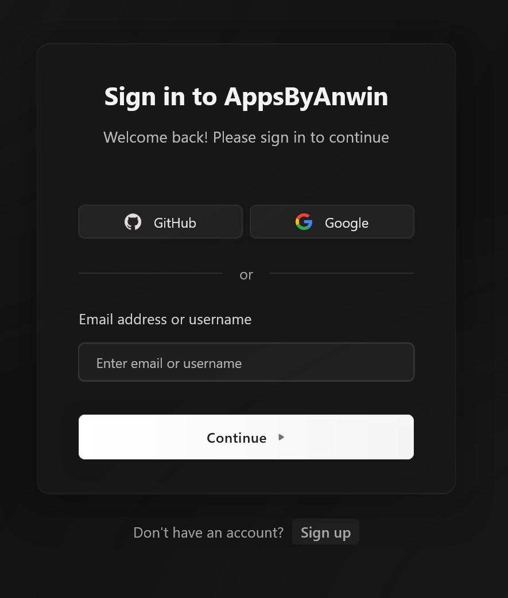
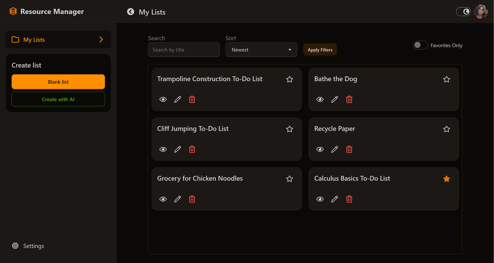
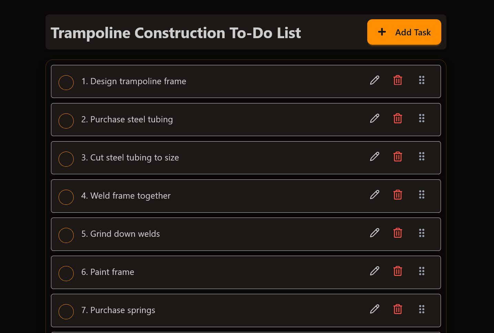
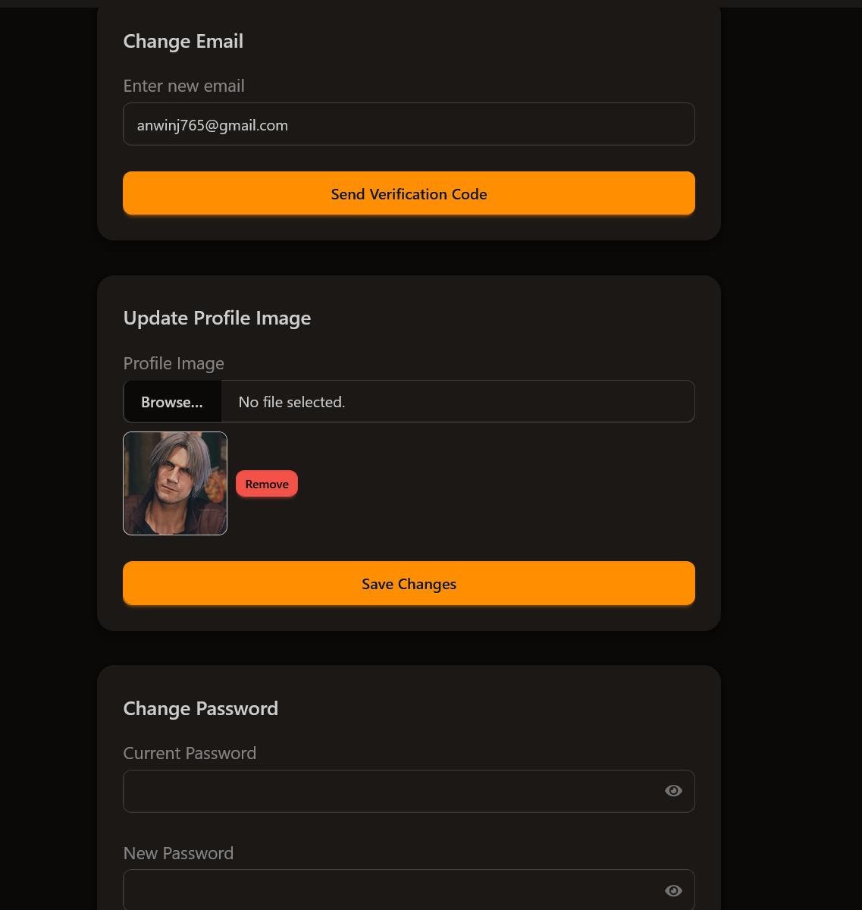
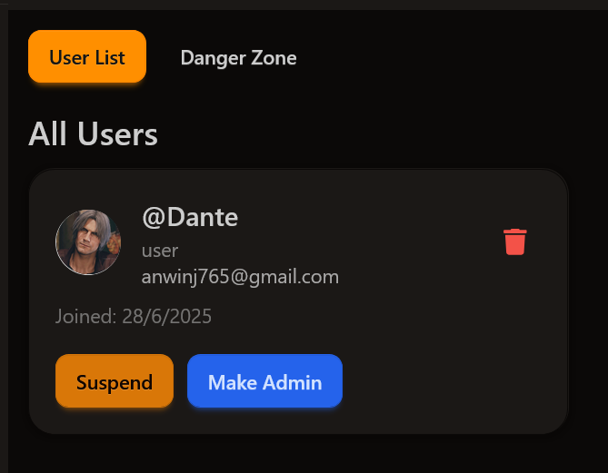
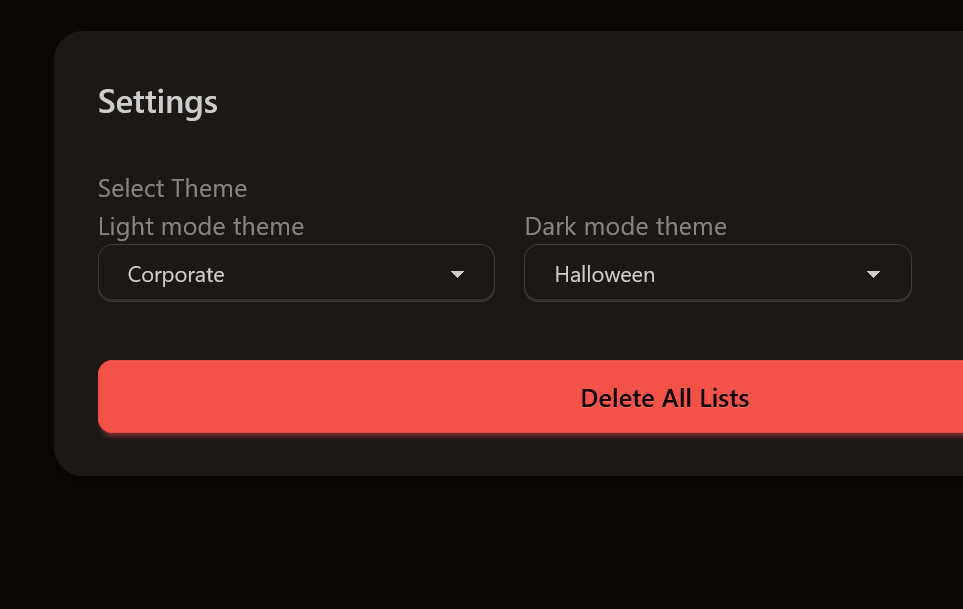

# To-Do Plus – Modern Full-Stack Productivity App

> A robust, production-ready to-do and resource management platform with authentication, theming, and modular architecture.

## Overview

To-Do Plus is a full-featured productivity application designed for real-world use. It enables users to manage tasks, lists, resources, and user profiles with a seamless experience. The app features secure authentication, user roles (admin, regular), profile management, and a customizable UI with theming support. Built with scalability and maintainability in mind, it demonstrates best practices in both frontend and backend development.

## Features

- ✨ **Full Authentication** – Secure login, registration, and user management via Clerk.
- 🗂️ **Feature-First Modular Structure** – Each domain (tasks, lists, resources, users, admin) is self-contained for easy extension.
- 🎨 **Theming** – Light/dark mode and theme switching powered by DaisyUI and custom context.
- 👤 **Profile Management** – Edit profile, change email/password, upload profile images, and manage account settings.
- 📝 **Task & List Management** – Create, edit, and organize tasks and lists with advanced filtering and pagination.
- 📦 **Resource Management** – Attach resources to lists/bags, with public/private visibility.
- 🛡️ **Admin Dashboard** – User suspension, danger zone actions, and admin-only controls.
- 🧩 **Reusable UI Components** – Modals, forms, dialogs, error boundaries, loaders, and more.
- 🔒 **Protected Routes** – Authenticated and role-based access control.
- 🚀 **Production-Ready** – Error boundaries, global error handling, Zod validation, and clean API structure.
- 🧪 **Type Safety** – TypeScript and Zod schemas throughout frontend and backend.
- 🌐 **RESTful API** – Well-structured Express backend with modular controllers, services, and middleware.
- ☁️ **File Uploads** – Cloudinary and local upload support for user images and resources.

## Tech Stack

- **Frontend:** React, TypeScript, Redux, DaisyUI, Clerk (auth), Zod, Vite
- **Backend:** Node.js, Express, TypeScript, REST API, Clerk integration
- **Database:** MongoDB (Mongoose ODM)
- **APIs:** RESTful endpoints for all resources, admin, and user management
- **Styling:** DaisyUI, custom CSS, theming context
- **Other:** Cloudinary (file uploads), Multer (middleware), Axios (API calls)

## Getting Started

### Prerequisites

- **Node.js** (v18+ recommended)
- **Yarn** or **npm**
- **MongoDB** (local or cloud instance)
- **Clerk** account (for authentication)
- **Cloudinary** account (for file uploads, optional)

### Environment Variables

Create `.env` files in both `client/` and `server/` directories. See example files or documentation for required variables, such as:

- `VITE_CLERK_PUBLISHABLE_KEY` (client)
- `MONGODB_URI`, `CLERK_SECRET_KEY`, `CLOUDINARY_URL`, etc. (server)

### Install Dependencies

In the project root, run:

```bash
cd client
yarn install # or npm install
cd ../server
yarn install # or npm install
```

### Running the App

#### 1. Start MongoDB

Ensure MongoDB is running locally or provide a connection string to a cloud instance in your server `.env`.

#### 2. Start the Backend

```bash
cd server
yarn dev # or npm run dev
# The backend will start on the port specified in your .env (default: 5000)
```

#### 3. Start the Frontend

```bash
cd client
yarn dev # or npm run dev
# The frontend will start on http://localhost:5173 by default
```

#### 4. Access the App

Visit `http://localhost:5173` in your browser. Register or log in with Clerk, then use the app!

---

## Folder Structure

- `client/` – React frontend (feature-first: each domain in `features/`, shared logic in `common/`, `lib/`, `hooks/`)
  - `features/` – Modular domains: `auth`, `user`, `admin`, `lists`, `tasks`, `resources`, etc.
  - `common/components/` – Shared UI (modals, forms, error boundaries, etc.)
  - `contexts/` – Theme context and providers
  - `layouts/` – App and auth layouts
  - `lib/` – API utilities, Axios config, environment
  - `router/` – Centralized routing
  - `store.ts` – Redux store setup
- `server/` – Express backend
  - `controllers/` – Route logic for each domain
  - `models/` – Mongoose data models (User, Task, List, etc.)
  - `routes/` – API endpoints
  - `middlewares/` – Auth, error handling, file upload, admin checks
  - `services/` – Business logic, integrations (AI, Clerk, Cloudinary)
  - `types/` – TypeScript types for all domains
  - `utils/` – Error classes, cookie utilities, user helpers

## How It Works

1. **User visits the app** – The frontend initializes Redux and theming, rendering the main app.
2. **Authentication** – Clerk handles login, registration, and user state. Protected routes ensure only authorized access.
3. **Navigation** – Authenticated users access dashboards, lists, tasks, and resources via sidebar/navbar.
4. **Feature Interaction** – Users create/edit tasks, lists, and resources. Admins manage users and system settings.
5. **API Communication** – Frontend feature APIs communicate with the Express backend for all CRUD operations.
6. **Database** – The backend uses MongoDB (via Mongoose) to persist all user, task, list, and resource data.
7. **Error Handling** – React error boundaries and global error displays catch and show issues.
8. **Theming** – Users can switch themes at any time, with context updating app-wide styles.

## Why It Matters

This project demonstrates a clean, scalable, and production-ready architecture for full-stack apps. It emphasizes modularity, type safety, UI/UX best practices, and real-world features like authentication, theming, and admin controls. The codebase is organized for easy extension and maintainability, making it an excellent reference for modern web development.

## Screenshots / Diagrams

### 1. Login/Register Screen

<p align="center">
  
</p>

### 2. Dashboard/Main Layout

<p align="center">
  
</p>

### 3. Task/List Management

<p align="center">
  
</p>

### 4. Profile Page

<p align="center">
  
</p>

### 5. Admin Dashboard

<p align="center">
  
</p>

### 6. Theming

<p align="center">
  
</p>
